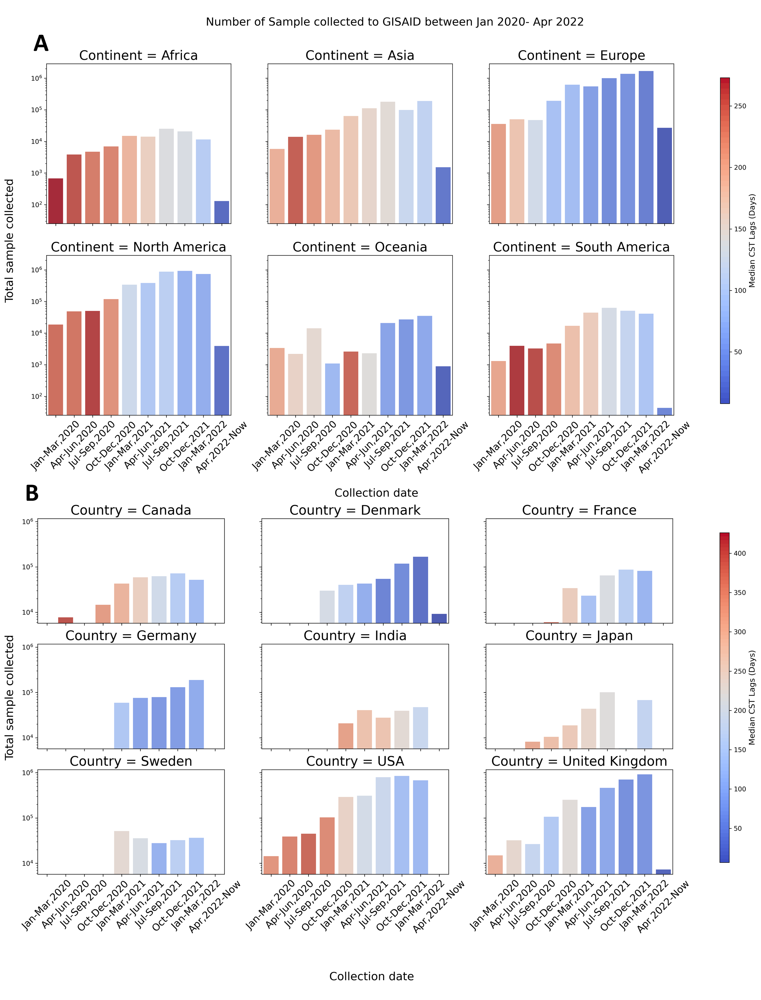
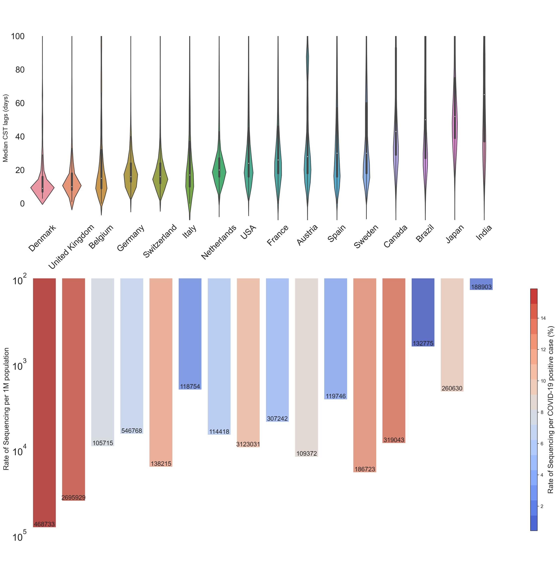
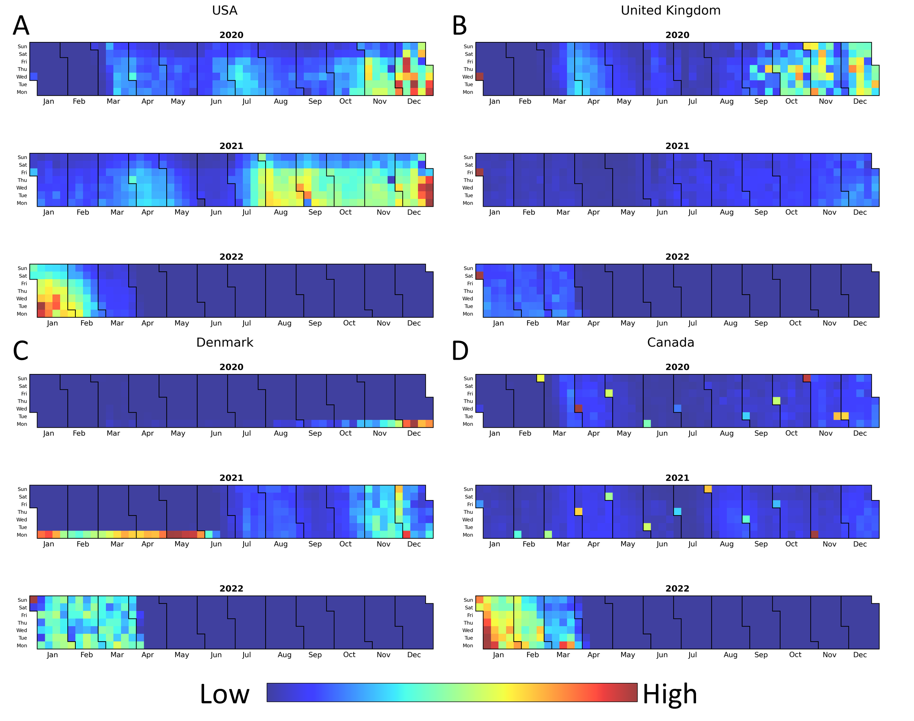

# Examining Collection-to-Submission lag time in GISAID
Examining GISAID lag time\
Note: GISAID metadata is too big to be uploaded to Github, but can be downloaded from the GISAID portal\
File description:
* analyses_code/gisaid_visualisation.py : Necessary codes to be used in the notebook
* 1_Visualisation.ipynb : The notebook with the plots
* dataset/Worldometer_19_04_2022: Data of country COVID cases downloaded from Worldometer.

Plots used:

Figure 1. Median CST lag over time across 6 continents (A) and top 9 countries by number of submitted genomes to GISAID (B) between January 1st 2020 to April 19th 2022. Y-axis denotes total sample collected for each time period on a log10 scale. The bar colours denote the median CST lag in days.

Figure 2. Visualisation of the 16 countries with over 100 000 submitted genomes to GISAID between January 1st, 2020 to April 19th, 2022. Top: Violin plot of the median CST lags in days, ordered from the shortest to longest time. Bottom: Bar plot of the rate of sequencing per 1 million population on a log10 scale. The bar colours denote the rate of sequencing per positive cases and the numbers inside the bar denote the total number of submissions to GISAID. Data of country population and total number of cases were taken from Worldometer as of 19th April 2022.

Figure 3. Heat maps of daily sample volumes collected between January 1st 2020 to April 19th 2022 in the USA (A), the UK (B), Denmark (C) and Canada (D). The colour in each square denotes the volume of sample collected for that day (high – red, low- blue) and is relative to that country and year. Y- axis in each plot denotes the day of the week, and the borders separate the months in each year plot.
